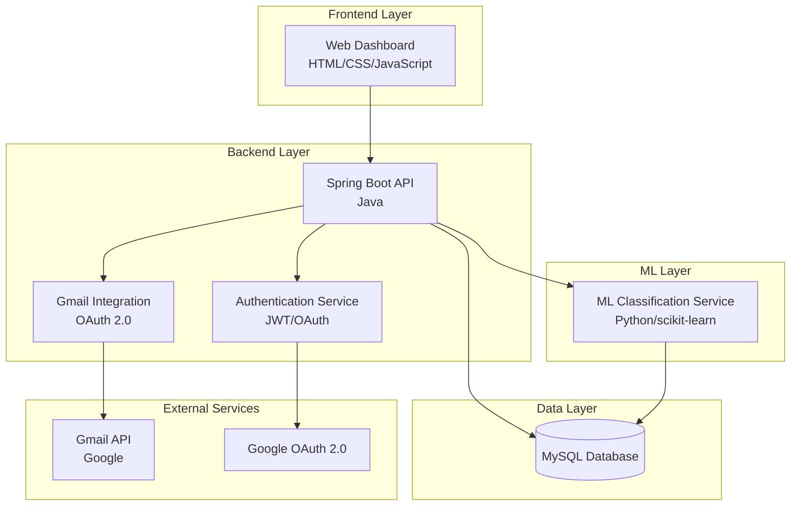

# Design Document: Smart Web Notification Intelligence Hub

## Overview

The Smart Web Notification Intelligence Hub (SWNIH) is a multi-tier web application that intelligently manages email notifications by automatically classifying their importance and presenting them in a prioritized dashboard. The system integrates with Gmail via OAuth 2.0, processes messages using hybrid classification (keyword-based rules + machine learning), and provides a responsive web interface for notification management.

The architecture follows a microservices approach with clear separation between the web frontend, Java Spring Boot backend, Python ML service, and MySQL database. This design ensures scalability, maintainability, and allows for independent deployment and scaling of different components.

## Architecture

The system employs a layered architecture with the following key components:



**Key Architectural Decisions:**

1. **Microservices Separation**: The ML service runs independently as a Python service, allowing for specialized ML libraries and independent scaling
2. **Stateless Design**: JWT tokens enable stateless authentication, improving scalability
3. **Database-Centric**: All processed data is stored in MySQL for consistency and reliability
4. **API-First**: RESTful APIs enable future mobile app or Chrome extension integration

## Components and Interfaces

### Frontend Component (Web Dashboard)

**Technology**: HTML5, CSS3, Vanilla JavaScript
**Responsibilities**:
- User authentication interface (login/register)
- OAuth 2.0 flow initiation for Gmail connection
- Prioritized message display with filtering and search
- Responsive design for desktop and mobile access

**Key Interfaces**:
- Authentication forms with client-side validation
- Dashboard with three priority panels (HIGH/MEDIUM/LOW)
- Search and filter controls
- Message detail modal/expansion view

### Backend API Service (Spring Boot)

**Technology**: Java 17, Spring Boot 3.x, Spring Security
**Responsibilities**:
- RESTful API endpoints for all frontend operations
- JWT token generation and validation
- OAuth 2.0 flow management with Google
- Gmail API integration and message fetching
- Message processing and storage coordination
- Request routing to ML service

**Key Classes**:
```java
@RestController
public class AuthController {
    // POST /api/auth/register, /api/auth/login
}

@RestController
public class GmailController {
    // GET /api/gmail/connect, /api/gmail/fetch
}

@RestController
public class MessageController {
    // GET /api/messages, /api/messages/{priority}
}

@Service
public class MessageProcessingService {
    // Coordinates fetching, processing, classification
}

@Service
public class GmailIntegrationService {
    // Handles OAuth flow and Gmail API calls
}
```

### ML Classification Service (Python)

**Technology**: Python 3.9+, scikit-learn, Flask/FastAPI
**Responsibilities**:
- TF-IDF vectorization of message content
- Machine learning model training and inference
- Confidence score calculation
- RESTful API for classification requests

**Key Components**:
```python
class MessageClassifier:
    def __init__(self):
        self.vectorizer = TfidfVectorizer()
        self.model = LogisticRegression()  # or MultinomialNB
    
    def classify(self, message_text: str) -> float:
        # Returns confidence score 0.0-1.0
        pass

class ClassificationAPI:
    # Flask/FastAPI endpoints for classification
    # POST /classify - accepts message text, returns confidence
```

### Authentication Service

**Technology**: Spring Security, JWT, OAuth 2.0
**Responsibilities**:
- User registration with password validation and bcrypt hashing
- JWT token generation with 24-hour expiration
- OAuth 2.0 integration with Google for Gmail access
- Token validation for protected endpoints

**Security Features**:
- Password requirements: 8+ chars, uppercase, lowercase, numeric
- bcrypt hashing with 12+ rounds
- AES-256 encryption for OAuth tokens
- HTTPS enforcement and CORS policies

### Gmail Integration Service

**Technology**: Google Gmail API, OAuth 2.0
**Responsibilities**:
- OAuth 2.0 authorization flow management
- Access token storage and refresh handling
- Message fetching with rate limit handling
- Exponential backoff retry logic

**API Integration**:
- Fetches most recent 50 messages per request
- Handles Gmail API rate limits (250 quota units/user/second)
- Automatic token refresh using stored refresh tokens

## Data Models

### Database Schema

**Users Table**:
```sql
CREATE TABLE users (
    id BIGINT PRIMARY KEY AUTO_INCREMENT,
    username VARCHAR(50) UNIQUE NOT NULL,
    email VARCHAR(100) UNIQUE NOT NULL,
    password_hash VARCHAR(255) NOT NULL,
    created_at TIMESTAMP DEFAULT CURRENT_TIMESTAMP,
    updated_at TIMESTAMP DEFAULT CURRENT_TIMESTAMP ON UPDATE CURRENT_TIMESTAMP
);
```

**OAuth Tokens Table**:
```sql
CREATE TABLE oauth_tokens (
    id BIGINT PRIMARY KEY AUTO_INCREMENT,
    user_id BIGINT NOT NULL,
    access_token_encrypted TEXT NOT NULL,
    refresh_token_encrypted TEXT NOT NULL,
    expires_at TIMESTAMP NOT NULL,
    created_at TIMESTAMP DEFAULT CURRENT_TIMESTAMP,
    FOREIGN KEY (user_id) REFERENCES users(id) ON DELETE CASCADE
);
```

**Messages Table**:
```sql
CREATE TABLE messages (
    id BIGINT PRIMARY KEY AUTO_INCREMENT,
    user_id BIGINT NOT NULL,
    sender VARCHAR(255) NOT NULL,
    subject TEXT NOT NULL,
    body TEXT NOT NULL,
    priority ENUM('HIGH', 'MEDIUM', 'LOW') NOT NULL,
    source VARCHAR(50) DEFAULT 'GMAIL',
    ml_confidence DECIMAL(3,2),
    timestamp TIMESTAMP NOT NULL,
    created_at TIMESTAMP DEFAULT CURRENT_TIMESTAMP,
    FOREIGN KEY (user_id) REFERENCES users(id) ON DELETE CASCADE,
    INDEX idx_user_priority (user_id, priority),
    INDEX idx_user_timestamp (user_id, timestamp),
    INDEX idx_sender (sender),
    UNIQUE KEY unique_message (user_id, sender, subject, timestamp)
);
```

### Entity Models

**Java Entities**:
```java
@Entity
@Table(name = "users")
public class User {
    @Id @GeneratedValue(strategy = GenerationType.IDENTITY)
    private Long id;
    
    @Column(unique = true, nullable = false)
    private String username;
    
    @Column(unique = true, nullable = false)
    private String email;
    
    @Column(nullable = false)
    private String passwordHash;
    
    // timestamps, getters, setters
}

@Entity
@Table(name = "messages")
public class Message {
    @Id @GeneratedValue(strategy = GenerationType.IDENTITY)
    private Long id;
    
    @ManyToOne(fetch = FetchType.LAZY)
    @JoinColumn(name = "user_id", nullable = false)
    private User user;
    
    @Column(nullable = false)
    private String sender;
    
    @Column(columnDefinition = "TEXT", nullable = false)
    private String subject;
    
    @Column(columnDefinition = "TEXT", nullable = false)
    private String body;
    
    @Enumerated(EnumType.STRING)
    @Column(nullable = false)
    private PriorityLevel priority;
    
    @Column(precision = 3, scale = 2)
    private BigDecimal mlConfidence;
    
    @Column(nullable = false)
    private LocalDateTime timestamp;
    
    // getters, setters
}

public enum PriorityLevel {
    HIGH, MEDIUM, LOW
}
```

### Message Processing Pipeline

**Processing Flow**:
1. **Fetch**: Gmail Integration Service retrieves messages via Gmail API
2. **Clean**: Remove HTML tags, normalize whitespace, convert to UTF-8
3. **Truncate**: Limit body content to 5000 characters
4. **Deduplicate**: Check for existing messages (same sender/subject within 1 hour)
5. **Classify**: Apply hybrid classification (keywords + ML)
6. **Store**: Save processed message with priority to database

**Classification Logic**:
```java
public class PriorityClassifier {
    
    public PriorityLevel classifyMessage(String subject, String body) {
        // Step 1: Keyword-based classification
        PriorityLevel keywordPriority = classifyByKeywords(subject + " " + body);
        
        // Step 2: ML classification
        double mlConfidence = mlService.classify(subject + " " + body);
        
        // Step 3: Hybrid decision logic
        if (mlConfidence > 0.7) {
            return PriorityLevel.HIGH;
        } else if (keywordPriority == PriorityLevel.HIGH) {
            return PriorityLevel.HIGH;
        } else if (mlConfidence > 0.4 || keywordPriority == PriorityLevel.MEDIUM) {
            return PriorityLevel.MEDIUM;
        } else {
            return PriorityLevel.LOW;
        }
    }
    
    private PriorityLevel classifyByKeywords(String text) {
        String lowerText = text.toLowerCase();
        
        if (containsAny(lowerText, HIGH_PRIORITY_KEYWORDS)) {
            return PriorityLevel.HIGH;
        } else if (containsAny(lowerText, MEDIUM_PRIORITY_KEYWORDS)) {
            return PriorityLevel.MEDIUM;
        } else if (containsAny(lowerText, LOW_PRIORITY_KEYWORDS)) {
            return PriorityLevel.LOW;
        }
        
        return null; // No keyword match
    }
    
    private static final String[] HIGH_PRIORITY_KEYWORDS = {
        "interview", "offer", "exam", "deadline", "urgent"
    };
    
    private static final String[] MEDIUM_PRIORITY_KEYWORDS = {
        "meeting", "reminder", "schedule", "appointment"
    };
    
    private static final String[] LOW_PRIORITY_KEYWORDS = {
        "sale", "discount", "promotion", "newsletter", "marketing"
    };
}
```

## Correctness Properties

*A property is a characteristic or behavior that should hold true across all valid executions of a system—essentially, a formal statement about what the system should do. Properties serve as the bridge between human-readable specifications and machine-verifiable correctness guarantees.*

Based on the prework analysis and property reflection to eliminate redundancy, the following properties validate the system's correctness:

### Property 1: User Registration and Authentication
*For any* valid user registration data (username, email, password meeting requirements), the system should create a user account with bcrypt-hashed password and generate valid JWT tokens upon login
**Validates: Requirements 1.1, 1.2, 1.4, 6.3**

### Property 2: Authentication Security
*For any* invalid credentials or expired JWT tokens, the system should reject authentication attempts and return appropriate error responses
**Validates: Requirements 1.3, 1.5, 7.7**

### Property 3: OAuth Integration Flow
*For any* user initiating Gmail connection, the system should redirect to Google OAuth, store encrypted tokens upon success, and handle token refresh automatically
**Validates: Requirements 2.1, 2.2, 2.5, 6.4**

### Property 4: Gmail Message Fetching
*For any* authenticated user, fetching messages should retrieve exactly 50 recent messages with proper rate limit handling and exponential backoff
**Validates: Requirements 2.3, 2.4**

### Property 5: Message Processing Pipeline
*For any* fetched Gmail message, the system should extract all required fields, clean HTML/whitespace, truncate to 5000 characters, and skip duplicates within 1-hour windows
**Validates: Requirements 3.1, 3.2, 3.3, 3.5**

### Property 6: Keyword-Based Classification
*For any* message content, keyword-based classification should assign HIGH priority for interview/offer/exam/deadline keywords, MEDIUM for meeting/reminder keywords, and LOW for sale/discount/promotion keywords
**Validates: Requirements 4.1, 4.2, 4.3**

### Property 7: ML Confidence Classification
*For any* message with ML confidence scores, the system should assign HIGH priority for scores > 0.7, MEDIUM for scores 0.4-0.7 (without strong keywords), and LOW for scores < 0.4 (without strong keywords)
**Validates: Requirements 4.4, 4.5, 4.6**

### Property 8: ML Service Response Format
*For any* classification request to the ML service, the response should contain confidence scores between 0.0 and 1.0
**Validates: Requirements 9.3, 9.4**

### Property 9: Data Persistence
*For any* processed message or user data, the system should store all required fields in the correct database tables with proper relationships
**Validates: Requirements 3.4, 4.8, 6.1, 6.2**

### Property 10: Dashboard Display Organization
*For any* user accessing the dashboard, messages should be organized in HIGH/MEDIUM/LOW priority panels, displayed in reverse chronological order, with all required fields visible
**Validates: Requirements 5.1, 5.2, 5.6**

### Property 11: Search and Filtering
*For any* search query or priority filter, the system should return only messages matching the specified criteria (sender/subject/content for search, priority level for filters)
**Validates: Requirements 5.3, 5.4**

### Property 12: Message Detail Display
*For any* message clicked by a user, the system should display the complete message content in an expanded view
**Validates: Requirements 5.5**

### Property 13: Pagination and Loading
*For any* dashboard load, the system should display the most recent 100 messages by default with pagination support for older messages
**Validates: Requirements 5.7**

### Property 14: API Endpoint Availability
*For any* required API endpoint (auth, gmail, messages), the system should accept the specified parameters and return appropriate responses
**Validates: Requirements 7.1, 7.2, 7.3, 7.4, 7.5, 7.6**

### Property 15: Error Handling
*For any* system error (database failures, API errors), the system should log errors appropriately and return descriptive error messages with correct HTTP status codes
**Validates: Requirements 6.6, 7.8**

### Property 16: Security Enforcement
*For any* client-server communication, the system should enforce HTTPS, implement CORS policies, and never expose encrypted tokens in API responses
**Validates: Requirements 8.1, 8.2, 8.3**

### Property 17: Data Privacy and Deletion
*For any* user account deletion request, the system should permanently remove all associated user data and messages from the database
**Validates: Requirements 8.4**

### Property 18: Rate Limiting
*For any* user making requests, the system should enforce rate limits of 100 requests per minute and block excessive requests
**Validates: Requirements 8.5**

### Property 19: Secure Logging
*For any* system event being logged, sensitive information (passwords, tokens) should be excluded from log files
**Validates: Requirements 8.6**

### Property 20: Database Connection Management
*For any* database operation, the system should use connection pooling with 5-20 concurrent connections as configured
**Validates: Requirements 6.5**

## Error Handling

The system implements comprehensive error handling across all layers:

### Authentication Errors
- **Invalid Credentials**: Return 401 Unauthorized with descriptive message
- **Expired Tokens**: Return 401 Unauthorized, require re-authentication
- **Password Validation**: Return 400 Bad Request with specific validation failures
- **Duplicate Registration**: Return 409 Conflict for existing username/email

### Gmail Integration Errors
- **OAuth Failures**: Return 400 Bad Request with OAuth error details
- **Rate Limit Exceeded**: Implement exponential backoff, return 429 Too Many Requests
- **Token Refresh Failures**: Require user to re-authorize Gmail connection
- **API Unavailable**: Return 503 Service Unavailable with retry guidance

### Message Processing Errors
- **Malformed Messages**: Log error, skip message, continue processing
- **Classification Failures**: Assign default MEDIUM priority, log for review
- **Database Errors**: Return 500 Internal Server Error, log full error details
- **Duplicate Detection**: Skip silently, log for monitoring

### API Error Responses
All API endpoints return consistent error format:
```json
{
    "error": {
        "code": "ERROR_CODE",
        "message": "Human-readable error description",
        "details": "Additional context when helpful",
        "timestamp": "2024-01-15T10:30:00Z"
    }
}
```

### Logging Strategy
- **Error Level**: All exceptions, authentication failures, external API errors
- **Warn Level**: Rate limit hits, token refresh attempts, duplicate messages
- **Info Level**: User registrations, successful authentications, message processing stats
- **Debug Level**: Detailed request/response data (excluding sensitive information)

## Testing Strategy

The system employs a dual testing approach combining unit tests and property-based tests for comprehensive coverage:

### Property-Based Testing
- **Framework**: Use QuickCheck for Java (or similar property testing library)
- **Configuration**: Minimum 100 iterations per property test to ensure thorough randomization
- **Coverage**: Each of the 20 correctness properties must be implemented as property-based tests
- **Tagging**: Each test tagged with format: **Feature: smart-web-notification-intelligence-hub, Property {number}: {property_text}**

**Example Property Test Structure**:
```java
@Property
@Tag("Feature: smart-web-notification-intelligence-hub, Property 1: User Registration and Authentication")
void userRegistrationCreatesValidAccount(@ForAll("validUserData") UserRegistrationData userData) {
    // Test that valid registration data creates account with proper password hashing
    User createdUser = authService.register(userData);
    
    assertThat(createdUser.getId()).isNotNull();
    assertThat(passwordEncoder.matches(userData.getPassword(), createdUser.getPasswordHash())).isTrue();
    
    String jwtToken = authService.login(userData.getEmail(), userData.getPassword());
    assertThat(jwtTokenValidator.isValid(jwtToken)).isTrue();
}
```

### Unit Testing
Unit tests complement property tests by focusing on:
- **Specific Examples**: Concrete test cases that demonstrate expected behavior
- **Edge Cases**: Boundary conditions and special scenarios
- **Integration Points**: Component interactions and API contracts
- **Error Conditions**: Specific error scenarios and exception handling

**Testing Balance**:
- **Property Tests**: Verify universal correctness across all inputs (80% of test coverage)
- **Unit Tests**: Validate specific examples and edge cases (20% of test coverage)
- **Integration Tests**: End-to-end workflow validation (separate test suite)

### Test Data Generation
- **User Data**: Generate valid/invalid usernames, emails, passwords
- **Message Data**: Generate various email formats, lengths, content types
- **ML Confidence**: Generate confidence scores across full 0.0-1.0 range
- **Keywords**: Generate messages with/without priority keywords
- **Timestamps**: Generate various date/time scenarios for duplicate detection

### Testing Infrastructure
- **Test Database**: Separate MySQL instance for testing with identical schema
- **Mock Services**: Mock Gmail API and ML service for isolated testing
- **Test Containers**: Use Testcontainers for integration testing with real database
- **CI/CD Integration**: All tests must pass before deployment

The comprehensive testing strategy ensures that both universal properties and specific edge cases are validated, providing confidence in system correctness and reliability.